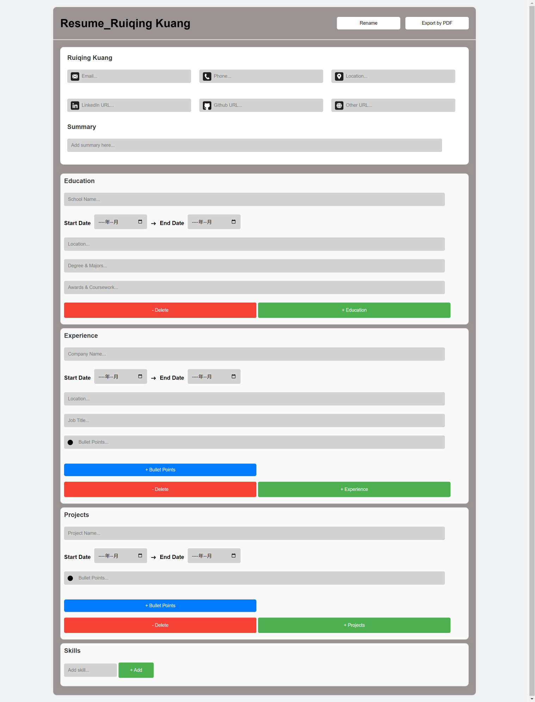

# Resume Builder Application

This project is a **Resume Builder** web application that allows users to input their personal details, education, work experience, skills. The application then formats this information into a professional resume using LaTeX and provides it as a downloadable PDF. The project is divided into two main parts: **Front-End** and **Back-End**.



## Table of Contents

- [Front-End](#front-end)
- [Back-End](#back-end)
- [Getting Started](#getting-started)
- [Requirements](#requirements)
- [Usage](#usage)

## Front-End

The front-end of the Resume Builder is built with **HTML, CSS, and JavaScript**. It is designed to be clean, minimalistic, and user-friendly, allowing users to easily enter their resume details. Below is a detailed breakdown of the front-end components:

### Technologies Used:

- **HTML**: To structure the web pages and create forms for user input.
- **CSS**: To style the forms and make the UI aesthetically pleasing and responsive.
- **JavaScript**: To validate user inputs and handle form interactions.

### Features:

1. **Form Sections**: The front-end consists of various sections to collect user information, including:

   - **Profile Details**: Fields for name, email, phone number, LinkedIn URL, GitHub URL, and location.
   - **Summary**: A text area where users can provide a summary of their career or objectives.
   - **Education**: Users can input details about their educational background, including institution name, degree, and dates. This section includes both **add** and **delete** functionality, allowing users to customize the number of education entries based on their personal achievements. The flexibility makes it easy to adjust the resume content according to the relevance of each educational experience.
   - **Work Experience**: Similar to the education section, users can provide details such as company name, job title, duration, and job responsibilities. The ability to **add** or **delete** multiple work experiences ensures that users can present a resume tailored to different job applications, focusing on the most relevant roles.
   - **Projects**: Users can add information about personal or professional projects, including project name, duration, and details. With **add** and **delete** functionality, users can effectively highlight the most significant projects, enhancing the overall impact of their resume.
   - **Skills**: This section provides a comprehensive list of computer science-related skills for users to choose from, making the process of skill selection efficient and convenient. The **auto-complete feature** allows users to quickly find specific skills, while the **add, delete, and reorder** functionality gives them complete control over the presentation of their skill set. Users can prioritize skills by adjusting their order, ensuring that the most relevant skills are prominently displayed.

2. **Interactive Design Elements**:
   - **Add and Remove Controls**: The education, work experience, and project sections all feature dedicated buttons for adding or removing entries. This interactive capability allows users to fully personalize their resume based on their unique experiences, providing a dynamic and intuitive user experience.
   - **Skill Management**: Users benefit from the ability to easily search for and select skills through the auto-complete feature, reducing the time required to find the right skills. Once added, skills can be removed or rearranged, ensuring the resume is always optimized for the desired role.

3. **Responsive Design**: The form is styled to be fully responsive, ensuring compatibility with both desktop and mobile devices. This guarantees that users can comfortably fill out their resume details regardless of the device they are using, making the application accessible and convenient.

4. **User-Friendly UI**:
   - **Clean and Intuitive Layout**: The front-end is designed with simplicity in mind, using clear section divisions and well-labeled input fields to guide users through the process. The layout is structured to provide a logical flow, making it easy for users to navigate through the different sections without feeling overwhelmed.
   - **Visual Design Elements**: Icons are included in the input fields to provide visual cues, making it easier for users to understand what type of information is required. This not only improves usability but also adds to the overall polished look of the interface. The use of color, spacing, and typography has been carefully considered to create a professional, aesthetically pleasing appearance that is both functional and attractive.

## Back-End

The back-end is built using **Python** with the **Flask** framework and **PyLaTeX** to generate PDF resumes from the collected data. Below is a detailed breakdown of the back-end components:

### Technologies Used:

- **Python (Flask)**: Flask is used to create the web server, manage routes, and handle incoming HTTP requests.
- **PyLaTeX**: A Python library used to dynamically create LaTeX files that are then compiled into PDF resumes.

### Features:

1. **Data Collection**:

   - The front-end sends the form data to the back-end using a `POST` request to the `/generate_resume` route.
   - Flask collects the form data, including profile details, education, work experience, projects, skills, and more.

2. **Resume Generation**:

   - The back-end uses **PyLaTeX** to create a LaTeX document, where all the user inputs are formatted into a professional resume structure.
   - Various sections such as **Summary**, **Education**, **Work Experience**, **Projects**, and **Skills** are dynamically added to the LaTeX document.
   - The LaTeX document is then compiled to generate a PDF (`resume.pdf`).

3. **PDF Download**:

   - The generated PDF is made available to the user for download via the Flask server.
   - The back-end handles errors and ensures that all required fields are filled before generating the PDF.

4. **Simplified Document Class**:

   - A minimal LaTeX document class (`minimal`) is used to prevent errors related to missing document class files, which ensures easy compilation on different systems.

## Getting Started

### Requirements

- **Python 3.x**
- **Flask**: Web framework for handling HTTP requests.
- **PyLaTeX**: To generate LaTeX documents and compile them into PDFs.
- **TeX Live** or **MikTeX**: To compile LaTeX files into PDFs.

Install the necessary Python packages:

```sh
pip install Flask pylatex
```

### Usage

1. **Run the Flask Server**:

   ```sh
   python app.py
   ```

2. **Access the Web Interface**:

   - Open a web browser and go to `http://127.0.0.1:5000/`.
   - Fill out the form with your resume details.
   - Click the "Generate Resume" button to generate a downloadable PDF.

3. **Download the Resume**:

   - After clicking "Generate Resume", a PDF file named `resume.pdf` will be generated and downloaded to your system.

## Notes

- Ensure that TeX Live or MikTeX is installed properly so that `pdflatex` is available for compiling LaTeX documents.
- The LaTeX document generation is handled by PyLaTeX, which requires an accessible LaTeX installation to compile the `.tex` files into a `.pdf`.

Feel free to customize the LaTeX template or the form fields to make the resume more personalized and unique.

